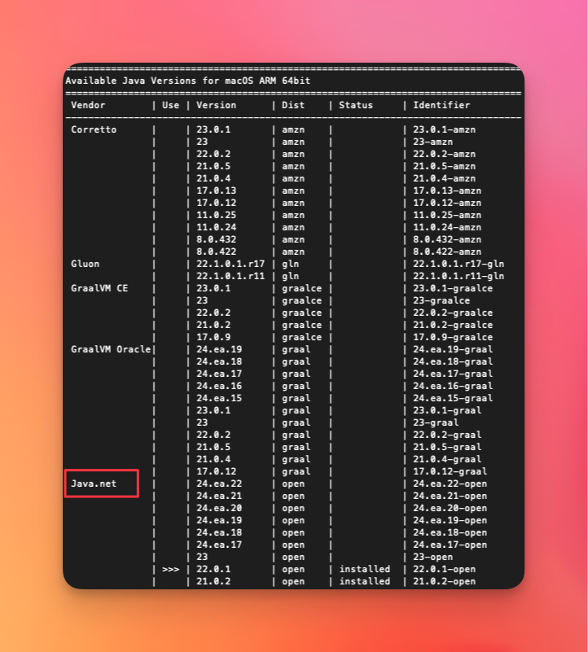
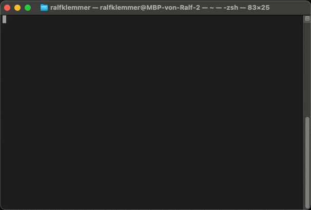
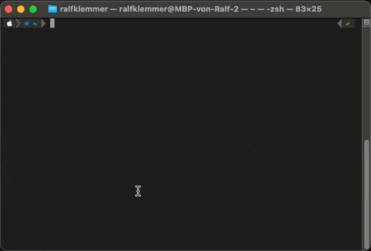
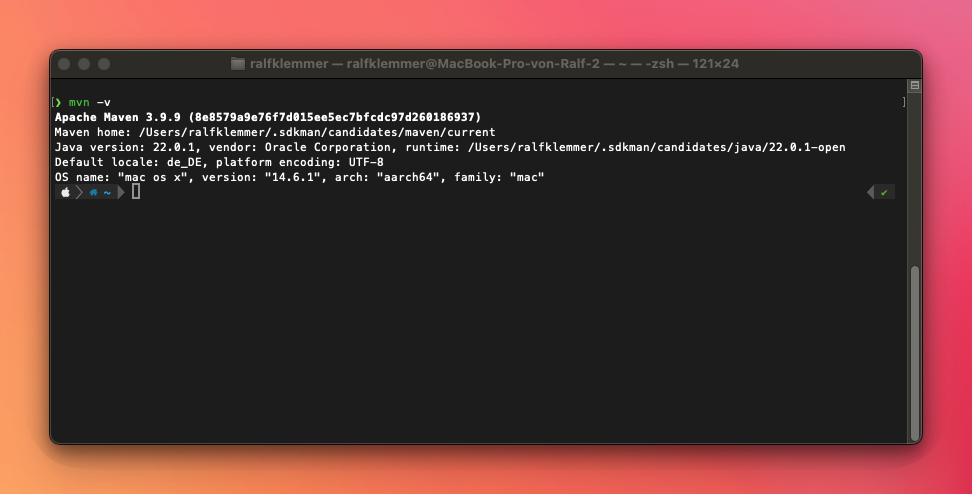
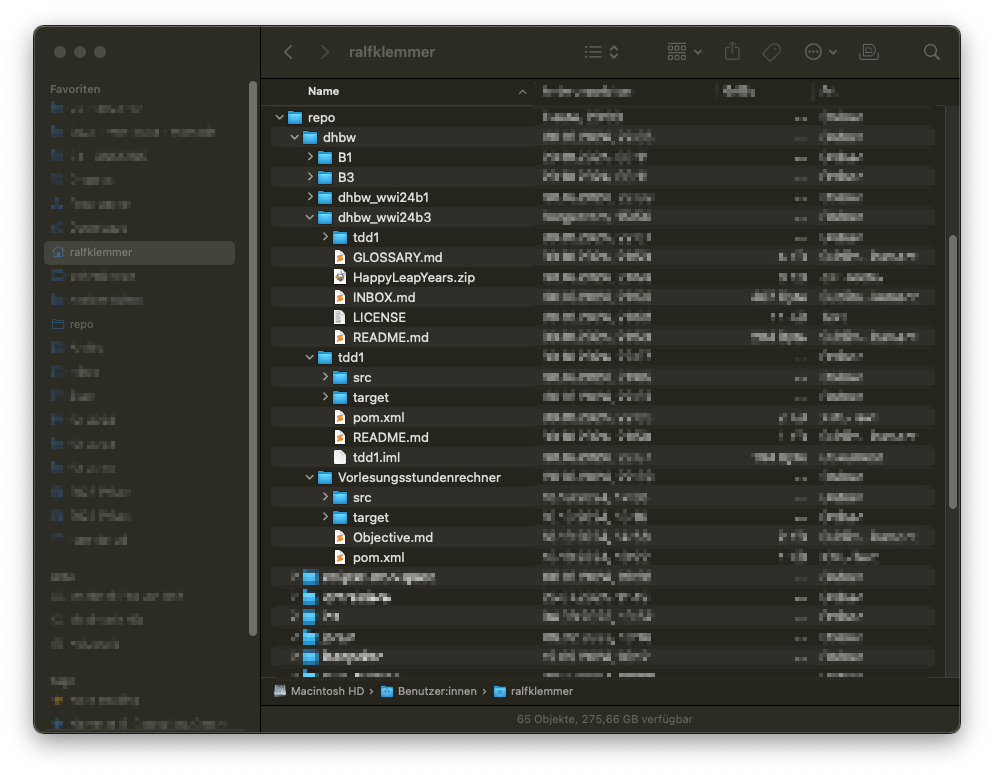

# Java Development On Mac

Die Einrichtung für die Java-Entwicklung auf dem Mac geht schnell und sollte in etwa 15 Minuten erledigt sein.
> Hintergrund
> - Auf dem Mac ist standardmäßig die ZSH-Shell im Terminal aktiv. Git und Java sind oft vorinstalliert, aber für die Java-Entwicklung sollten wir eine andere Java-Version verwenden.
> - Auf dem Mac werden Programme und Daten im Benutzerverzeichnis gespeichert, z.B. ist der Benutzerordner für ```ralfklemmer``` unter ```/Users/ralfklemmer/``` zu finden.


# :one: Schnellinstallation der Programme mit Homebrew (empfohlen)

## Installation Homebrew
Homebrew ist ein beliebter Paketmanager für den Mac (<https://brew.sh/>). Installation im Terminal über:
```bash 
/bin/bash -c "$(curl -fsSL https://raw.githubusercontent.com/Homebrew/install/HEAD/install.sh)"
```

## Quickinstall der IntelliJ, Eclipse, Sublime-Text
### IntelliJ Toolbox
```bash
brew install --cask jetbrains-toolbox
```

### Eclipse Installer
```bash
brew install --cask eclipse-installer
```

### Sublime-Text
```bash
brew install --cask sublime-text
```

# :two: Konfiguration für die Java-Entwicklung
> Zuvor muss entweder die Schnellinstallation oder die manuelle Installtion ausgeführt worden sein.


## SDKMAN
SDKMAN ist ein Tool, das das Installieren und Wechseln zwischen Java-Versionen (und anderen Tools) vereinfacht <https://sdkman.io/>. 
Somit wird es leicht mit mehrere Projekte mit unterschiedlichen Java-Versionen zu arbeiten.

```bash
curl -s "https://get.sdkman.io" | bash
```
Für eine detaillierte Anleitung zur Installation siehe <https://sdkman.io/install>

## Java über SDKMAN installieren
Für eine reibungslose Zusammenarbeit im Team sollten alle dieselbe Java-Version verwenden, idealerweise vom gleichen Distributor (z.B. OpenJDK für Java 23). Da Mac-User häufig eine spezielle Java-Version von Apple haben, ist es ratsam, einen plattformunabhängigen Distributor wie OpenJDK zu verwenden (<https://openjdk.org/projects/jdk/>).

Zeige verfügbare Java-Versionen an:
```bash 
sdk list java
```
 


Installiere die gewünschte Java-Version:
```bash 
sdk install java xxx-xx
```
 

## Maven über SDKMAN installieren
Zeige verfügbare Maven-Versionen an:
```bash 
sdk list maven
```

Installiere die gewünschte Maven-Version:
```bash 
sdk install maven x.x.x
```
 

## :ok_hand: Überprüfung der Installation
Um zu überprüfen, ob alles korrekt installiert wurde, gib folgenden Befehl ein:
```bash 
mvn -v
```
Die verwendeten Maven- und Java-Version werden dir angezeigt.



# :three: Pimp my Terminal


## Oh-My-ZSH installieren
Installiere Oh-My-ZSH über:
```bash 
sh -c "$(curl -fsSL https://raw.github.com/ohmyzsh/ohmyzsh/master/tools/install.sh)"
```
### Theme PowerLevel10k installieren
#### a) Schriftarten installieren
Dieses Theme benötigt eine Schriftart, die auch Icons enthalten. Entpacke daher die Fonts in dieser zip-Datei und installiere sie per Doppelklick. \
[:package:   Download MesloLGS Fonts](./resources/Font_MesloLGS.zip)

> Bei Problemen schaue dir die [Dokumentation des Autors von Powerlevel10k](https://github.com/romkatv/powerlevel10k?tab=readme-ov-file#meslo-nerd-font-patched-for-powerlevel10k) an.

#### b) Terminal Schriftart wechseln
 

#### c) Theme installieren
```bash
git clone --depth=1 https://github.com/romkatv/powerlevel10k.git ${ZSH_CUSTOM:-$HOME/.oh-my-zsh/custom}/themes/powerlevel10k
```
#### d) Theme in .zshrc aktivieren
> Bitte sicherstellen, dass du in deinem Benutzerverzeichnis stehst!
> 


## Wie verwalte ich mehrere Coding Projekte?
Es ist hilfreich die ausgecheckten Repositories an einem Ort zu haben. Bei mir ist dies im Benutzerverzeichnis im Unterordner ```repo```.
Darin habe ich z.B. Unterordner nach Firma oder Projekt. Darin befinden sich dann die eigentlichen geclonten git-Repositories.
Hier ein Beispiel wie ich die DHBW Repositories bei mir habe:


# Appendix
## Manuelle Installation der Programme
> Nur falls Schnellinstalltion nicht möglich.
> 
### Eclipse
Eclipse Direktdownload: <https://www.eclipse.org/downloads/packages/> (Eclipse IDE for Java Developers) \
Eclipse via Installer: <https://www.eclipse.org/downloads/packages/installer> (Eclipse IDE for Java Developers)

### IntelliJ
IntelliJ Direktdownload: <https://www.jetbrains.com/idea/download/?section=mac> (runter scrollen für die kostenlose Community Edition) \
IntelliJ via Toolbox: <https://www.jetbrains.com/toolbox-app/> 

### Sublime-Text
Download unter: <https://www.sublimetext.com/>

# :construction: IDEEN FÜR WEITERE DOKU :construction:

### :construction: Nützliche Eclipse Plugins
tbd

### :construction: Nützliche IntelliJ Plugins
tbd

# :construction: Fortgeschrittene Themen
## :construction: SDKMAN automatisch die Java-Version wechseln lassen
tbd